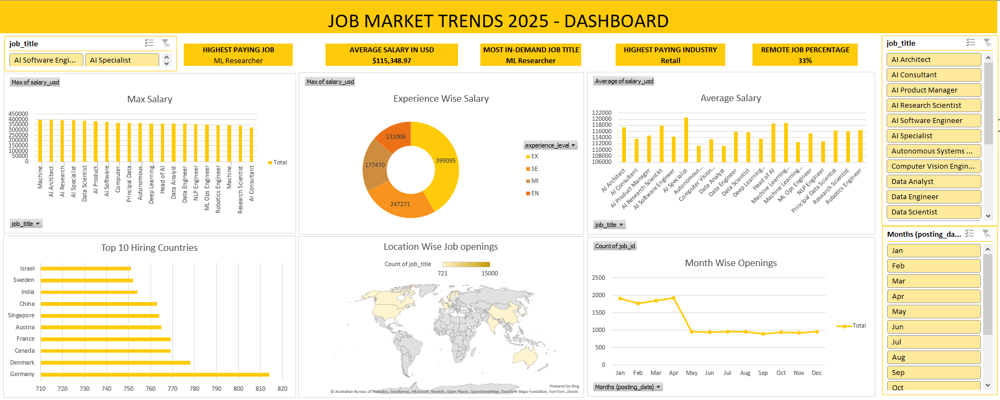

# JobMarket-ExcelDB

# 💼 Salary Insights Dashboard Project

This project presents a comprehensive data analysis and visualization of salary trends across various job roles, work environments, and locations. Built using Excel, it includes data cleaning, pivot tables, and interactive dashboards for exploratory insights.

## 📊 Key Features

- ✅ Cleaned and structured dataset for clarity and consistency  
- 📈 Pivot tables for analyzing salaries across job titles, experience levels, and remote work status  
- 📊 Dashboard summarizing:
  - Average salary (USD)
  - Top 10 high-paying job roles
  - Remote vs. on-site job distribution
- 🔍 Visual insights to support decision-making in tech recruitment or career planning

## 📂 File Structure

- `CLEAN DATA`: Preprocessed and structured raw data  
- `PIVOT`: Aggregated summaries using pivot tables  
- `DASHBOARD`: Visualized insights and key metrics  
- `Sheet1`, `Sheet2`, `Sheet3`: (Optional/Intermediate work or unused)

## 🛠 Tools Used

- **Microsoft Excel**: For cleaning, analysis, and dashboard creation

## 🧠 Insights (Sample)

- 📌 The average salary across roles is **~$115,349 USD**
- 👨‍💻 Job roles with highest salaries include **Machine Learning Engineer**, **Data Scientist**, and **Cloud Architect**
- 🌐 Majority of high-paying jobs offer **remote** flexibility

## 🚀 Future Improvements

- Export dashboard to interactive tools (e.g., Power BI, Tableau)
- Integrate filtering for dynamic role/location selection
- Version 2 using Python/Pandas for backend processing

## 📊 Dashboard Preview

Here’s a snapshot of the Excel dashboard showing key insights like average salary, top job roles, and remote work distribution:

